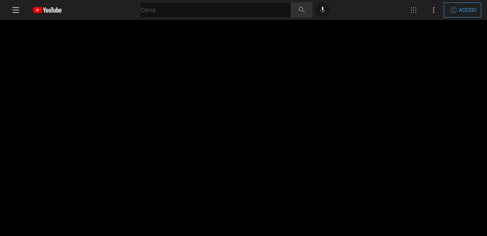
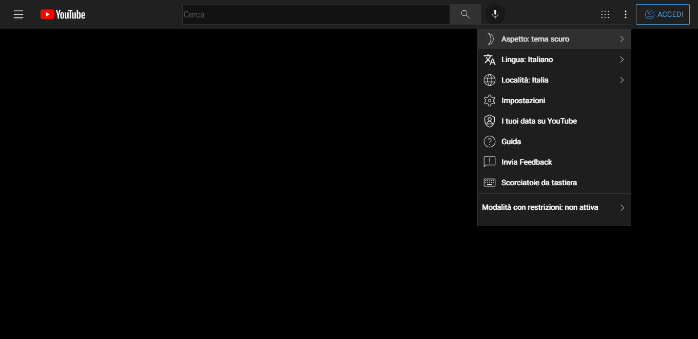
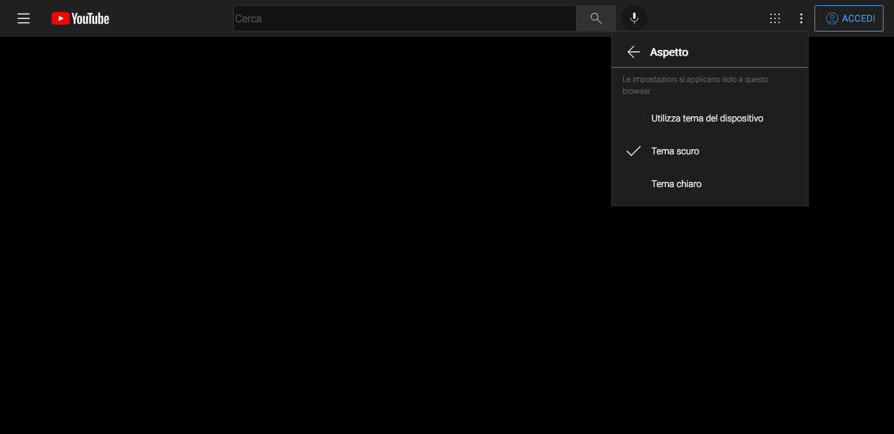
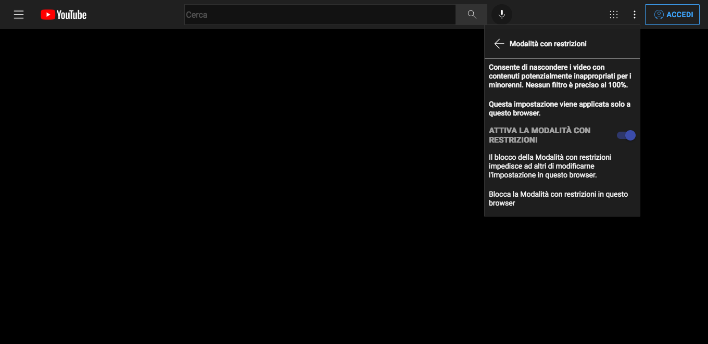

I started this little project where I create a YouTube (web) clone.
I'm working with angular and every push I insert a screenshot of the work done. My intent is to have the home page complete with all components and the finished layout. Once the layout is complete I want to add the logic that allows me to make an API call to search for videos on youtube. With the result I will populate the home page and possibly the specific search page.

___________

